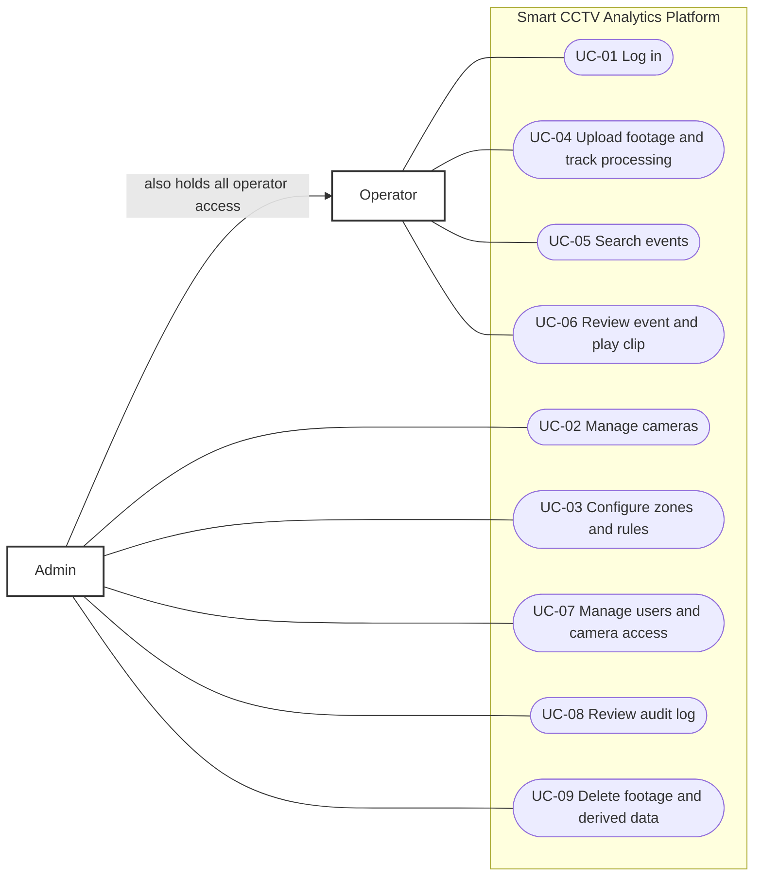

# Requirements and Analysis

Status: Week 1 draft. Version 0.1, 2026-10-06.
Related: [Project charter](Project_Charter.docx), [architecture](03-architecture.md), [database design](04-database-design.md), [API contract](api/openapi.yaml).

## 1. Purpose and scope

The Smart CCTV Analytics Platform turns recorded security-camera footage into a searchable record of events. An operator uploads footage for a camera. The system detects and tracks people and vehicles, creates events, and lets users search those events and play the matching clips.

**In scope** (charter Section 2): detection and tracking on recorded footage, rule-based events, searchable event history with clip playback, role-based access, encrypted storage, audit logging, cloud deployment.

**Out of scope** (charter Section 2.3): live physical camera integration, facial recognition, native mobile app, multi-tenant support, alarm or dispatch integrations.

## 2. Users and roles

| Role | Description | Can do |
|---|---|---|
| **Admin** | Manages the system | Everything an operator can do, plus manage cameras, zones, rules, users, access, videos, and view the audit log |
| **Operator** | Security staff who review events | Upload footage to permitted cameras, search and review events, play clips for permitted cameras |
| **Detection service** | Internal system actor | Reports job status and events back to the API using a service token. Not a human user. |

## 3. Use cases

An Admin can do everything an Operator can, so the diagram links each use case to the lowest role that may perform it.

| ID | Use case | Actor | Main flow | Notable alternatives |
|---|---|---|---|---|
| UC-01 | Log in | Admin, Operator | Enter email and password, receive a session token | Wrong password: generic error, attempt logged. Disabled account: refused. |
| UC-02 | Manage cameras | Admin | Create, edit or remove a camera with name and location | Removing a camera with footage requires confirming deletion of its data |
| UC-03 | Configure zones and rules | Admin | Draw a restricted zone on a camera, enable loitering, zone-entry or after-hours rules with parameters | Invalid polygon or parameters: validation error |
| UC-04 | Upload footage and track processing | Operator, Admin | Choose a camera, upload a clip, give the time the footage was recorded, watch job status until done | Wrong file type or too large: rejected before storage. Processing fails: job shows failed with a reason. |
| UC-05 | Search events | Operator, Admin | Filter by camera, time range, event type, object label and confidence, page through results | No results: empty state. Operators only see cameras they are assigned. |
| UC-06 | Review event and play clip | Operator, Admin | Open an event, see thumbnail and details, play the clip | Clip expired link: request a fresh link |
| UC-07 | Manage users and camera access | Admin | Create or disable users, assign which cameras each operator can see | Cannot remove the last active admin |
| UC-08 | Review audit log | Admin | Filter by user, action and date | None |
| UC-09 | Delete footage and derived data | Admin | Delete a video, which also deletes its events, clips and thumbnails | Deletion is itself audited |

## 4. Functional requirements

Priority uses MoSCoW: **Must** is needed for the project to count as complete, **Should** is planned but can slip, **Could** is a stretch.

| ID | Requirement | Priority | Use case |
|---|---|---|---|
| FR-01 | Users log in with email and password and receive a signed token with an expiry | Must | UC-01 |
| FR-02 | The system has two roles, Admin and Operator, enforced on the server for every endpoint | Must | all |
| FR-03 | Admins create, edit and disable users | Must | UC-07 |
| FR-04 | Admins assign cameras to operators; operators can only access assigned cameras | Must | UC-07 |
| FR-05 | Admins create, view, edit and delete cameras | Must | UC-02 |
| FR-06 | Admins define restricted zones as polygons on a camera | Should | UC-03 |
| FR-07 | Admins enable and configure event rules per camera | Should | UC-03 |
| FR-08 | Operators and admins upload a recorded video for a camera, with the time it was recorded | Must | UC-04 |
| FR-09 | Uploads are processed in the background and job status (queued, running, done, failed) is visible | Must | UC-04 |
| FR-10 | The system detects and tracks people and vehicles and creates one object-detected event per tracked object, with label, confidence, first and last seen time, thumbnail and clip | Must | UC-04 |
| FR-11 | Rule events are generated: loitering (person stays in a zone longer than N seconds), restricted-zone entry, after-hours vehicle activity | Should | UC-03 |
| FR-12 | Users search events by camera, time range, event type, object label and minimum confidence, with paging and sorting by time | Must | UC-05 |
| FR-13 | Users open an event, view its details and play its clip | Must | UC-06 |
| FR-14 | Search and clip access are limited to the user's permitted cameras | Must | UC-05, UC-06 |
| FR-15 | The system records an audit entry for logins, searches, event and clip views, uploads, and any change to cameras, users, rules or videos | Must | UC-08 |
| FR-16 | Admins view and filter the audit log | Should | UC-08 |
| FR-17 | Admins delete a video together with its events, clips and thumbnails | Should | UC-09 |

## 5. Non-functional requirements

### Security

| ID | Requirement |
|---|---|
| NFR-S1 | All traffic uses HTTPS/TLS |
| NFR-S2 | Passwords are stored only as salted hashes (BCrypt); plaintext is never logged or stored |
| NFR-S3 | Authorization is checked on the server for every request, never only hidden in the UI |
| NFR-S4 | Stored videos, clips and thumbnails are encrypted at rest; the database volume is encrypted |
| NFR-S5 | Uploads are validated for file type, content and size; file names are never used as storage paths |
| NFR-S6 | Clip and thumbnail links are short-lived signed links, not permanent public URLs |
| NFR-S7 | Secrets and keys are kept in environment variables or a secrets manager and never committed |
| NFR-S8 | The detection service accepts callbacks only with a service token, and internal endpoints are not reachable by browsers |
| NFR-S9 | Repeated failed logins are limited |
| NFR-S10 | Dependency vulnerability scanning runs in CI (Dependabot) |

### Performance and accuracy (targets to validate in Week 12)

| ID | Requirement |
|---|---|
| NFR-P1 | Event search returns in under 2 seconds at the 95th percentile with 100,000 events stored |
| NFR-P2 | A 5-minute 720p clip is processed in under 15 minutes on the CPU instance |
| NFR-A1 | At least 80% detection precision for person and vehicle classes on the held-out evaluation set (charter Section 2.1) |

NFR-P1 and NFR-P2 are initial targets chosen for a prototype, not measured results.

### Other

| ID | Requirement |
|---|---|
| NFR-U1 | The dashboard works in current Chrome, Firefox and Safari at laptop width |
| NFR-M1 | Backend unit and integration tests run in CI on every push |
| NFR-M2 | The API is documented in an OpenAPI file that matches the implementation |
| NFR-D1 | All services run in containers and the final system is hosted on AWS |
| NFR-PR1 | No facial recognition or biometric identification. Only public, licensed or consenting footage is used. |
| NFR-PR2 | Footage and derived data are deleted after final grading (charter Section 3.4) |

## 6. Assumptions and constraints

- Input is **recorded footage uploaded as files**. Live camera streams are out of scope, so a "camera" in the system is a named logical source that footage is attached to.
- One organization, up to about 10 cameras and 100,000 events.
- Detection uses a pretrained model; there is no custom training.
- Solo developer, 15 weeks, free-tier and student cloud credits.

## 7. Traceability to charter objectives

| Charter objective (Section 2.1) | Requirements |
|---|---|
| At least 80% detection precision by Week 12 | FR-10, NFR-A1 |
| Publicly accessible cloud deployment by Week 13 | NFR-D1 |
| RBAC and encrypted storage by Week 11 | FR-02, FR-04, FR-14, NFR-S3, NFR-S4 |
| Search and filter by camera, time and event type by Week 10 | FR-12, FR-13, NFR-P1 |
| Weekly reports, GitHub, Trello throughout | Process, not a system requirement |

## 8. Open questions for the instructor

1. Is uploaded recorded footage acceptable as the camera input, given live streams are out of scope?
2. Are AWS student credits available, or should the plan assume the free tier only?
3. Should the weekly report be submitted through a specific channel or template?
