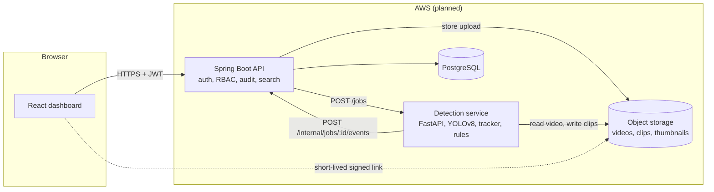
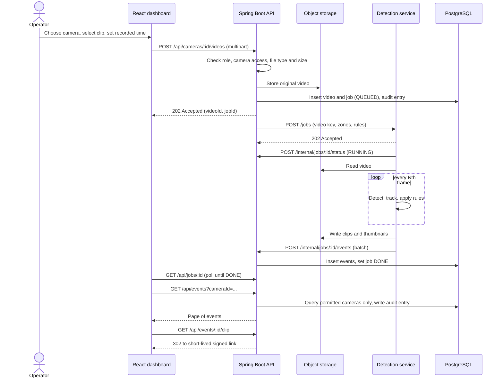

# System Architecture

Status: Week 2 deliverable. Version 0.1, 2026-10-06.
Related: [requirements](01-requirements.md), [database design](04-database-design.md), [API contract](api/openapi.yaml), [technology decisions](05-tech-stack-decisions.md).

## 1. Overview

Four runtime parts plus storage:

| Part | Responsibility | Technology |
|---|---|---|
| Dashboard | Login, camera setup, upload, event search, clip playback | React, TypeScript, Vite |
| API | Authentication, authorization, audit logging, data access, job orchestration | Spring Boot 3, Java 21 |
| Detection service | Detect, track, apply event rules, cut clips and thumbnails | FastAPI, YOLOv8, built-in tracker |
| Database | Users, cameras, zones, rules, videos, jobs, events, audit log | PostgreSQL |
| Object storage | Original videos, event clips, thumbnails | AWS S3 (local folder in development) |

The API is the only component browsers talk to. The detection service is internal and is never exposed to the internet.

## 2. Component diagram



## 3. Upload-to-event flow



## 4. Backend and detection service contract

The API submits a job and returns to the browser immediately. The detection service works in the background and reports back over HTTP. There is no message broker (see [decision D4](05-tech-stack-decisions.md)).

**API to detection service**: `POST /jobs`

```json
{
  "jobId": 42,
  "cameraId": 7,
  "videoKey": "videos/7/2026/10/6f1c....mp4",
  "recordedStartAt": "2026-10-04T21:30:00Z",
  "frameStride": 3,
  "minConfidence": 0.4,
  "zones": [
    { "id": 3, "name": "Loading dock", "polygon": [[0.1,0.5],[0.6,0.5],[0.6,0.95],[0.1,0.95]] }
  ],
  "rules": [
    { "id": 11, "type": "LOITERING", "zoneId": 3, "params": { "minSeconds": 30 } },
    { "id": 12, "type": "AFTER_HOURS_VEHICLE", "zoneId": null, "params": { "start": "22:00", "end": "06:00" } }
  ]
}
```

Response: `202 Accepted`. Polygon points are normalized to 0..1 so they do not depend on video resolution.

**Detection service to API**: both calls carry an `X-Service-Token` header.

- `POST /internal/jobs/{jobId}/status` with `{ "status": "RUNNING" }` or `{ "status": "FAILED", "error": "..." }`
- `POST /internal/jobs/{jobId}/events` with the list of events. The API stores them and marks the job `DONE`. Re-sending replaces the job's previous events, so a retry is safe.

An event carries: `eventType`, `objectLabel`, `trackId`, `confidence`, `videoOffsetStartMs`, `videoOffsetEndMs`, a representative `bbox`, optional `zoneId` and `ruleId`, and the storage keys of the `thumbnail` and `clip`. The API computes absolute `startedAt` and `endedAt` from the video's recorded start time plus the offsets.

## 5. Event generation

1. Sample every Nth frame (`frameStride`) to keep CPU cost manageable.
2. Run YOLOv8 and keep person, car, motorcycle, bus and truck above the confidence threshold.
3. Track objects across frames with the tracker so each real object has one track id.
4. Emit one `OBJECT_DETECTED` event per track, using the track's highest-confidence frame for the thumbnail.
5. Apply rules to each track:
   - **LOITERING**: a person's track stays inside a zone longer than `minSeconds`.
   - **ZONE_ENTRY**: a track first enters a restricted zone.
   - **AFTER_HOURS_VEHICLE**: a vehicle track appears when its absolute time falls inside the configured window.
6. Cut a short clip around each event (a few seconds of padding either side) and save it with the thumbnail.

## 6. Security architecture

| Boundary or asset | Control |
|---|---|
| Browser to API | TLS, JWT bearer token, server-side role and camera-access checks on every endpoint |
| Passwords | BCrypt hashes only |
| API to detection service | Private network only, shared service token, no public route |
| Video, clip and thumbnail storage | Private bucket, server-side encryption, no public access, short-lived signed links |
| Uploads | Type, content and size validation; generated storage keys, never user file names |
| Database | Encrypted volume, least-privilege application user, no direct internet access |
| Accountability | Audit log for logins, searches, views, uploads and administrative changes |
| Secrets | Environment variables or AWS Secrets Manager, never in Git |
| Supply chain | Dependabot and CI builds on every push |

## 7. Deployment mapping (planned)

Final choices are confirmed in Week 3 once cloud credits are known.

| Component | AWS service |
|---|---|
| Dashboard | S3 static hosting behind CloudFront |
| API | ECS Fargate (or a single EC2 instance if budget is tight) behind an Application Load Balancer with an ACM certificate |
| Detection service | ECS Fargate or EC2, CPU only, private subnet |
| Database | RDS for PostgreSQL, encrypted |
| Storage | S3, private bucket with server-side encryption |
| Secrets | Secrets Manager or SSM Parameter Store |
| Images and CI | GitHub Actions builds containers; images pushed to ECR |

Local development uses `docker-compose.yml` for PostgreSQL, the API and the detection service, with a local folder standing in for S3.

## 8. Known gaps

- The scaffold's detection service only has `/health` and a single-image `/detect` stub. The `/jobs` flow above is design, not code yet.
- Storage, authentication and Flyway migrations are not implemented yet (Weeks 6 and 7 in the plan).
