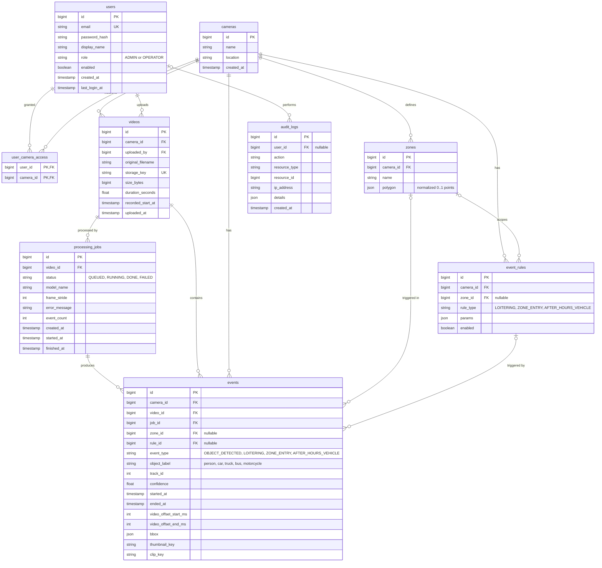

# Database Design

Status: Week 2 deliverable. Version 0.1, 2026-10-06.
Related: [requirements](01-requirements.md), [architecture](03-architecture.md).

## 1. Entity-relationship diagram

## 2. Table notes

| Table | Notes |
|---|---|
| `users` | Email is unique. Role is `ADMIN` or `OPERATOR`. Disabled users cannot log in. |
| `cameras` | A named logical source. There is no stream URL because input is uploaded footage. |
| `user_camera_access` | Join table. An operator sees a camera only if a row exists. Admins see all cameras. |
| `zones` | Polygon stored as JSON points normalized to 0..1, independent of video resolution. |
| `event_rules` | One row per enabled rule. `params` holds rule settings, for example `{"minSeconds":30}` or `{"start":"22:00","end":"06:00"}`. |
| `videos` | `recorded_start_at` is the time the footage was captured, supplied at upload. All event times derive from it. `storage_key` is generated, never the user's file name. |
| `processing_jobs` | One row per processing run. Keeps status, errors and which model was used, so results can be traced and re-run. |
| `events` | One row per tracked object or triggered rule. `started_at` equals the video's `recorded_start_at` plus the offset. `camera_id` is stored on the event for fast filtering. |
| `audit_logs` | Append-only. `user_id` is nullable for failed logins where no user matched. |

## 3. Indexes

| Index | Serves |
|---|---|
| `events (camera_id, started_at DESC)` | The main search: events for a camera in a time range |
| `events (event_type, started_at DESC)` | Search by event type |
| `events (object_label)` | Filter by person or vehicle type |
| `events (job_id)` | Replace or delete a job's events |
| `videos (camera_id, uploaded_at DESC)` | Footage list per camera |
| `audit_logs (created_at DESC)` | Admin audit view |
| `audit_logs (user_id, created_at DESC)` | Audit view filtered by user |
| `users (email)` unique | Login lookup |

## 4. Integrity and deletion rules

- Deleting a video removes its jobs and events (cascade) and the API removes its stored clips and thumbnails. The deletion is written to the audit log first.
- Deleting a camera is blocked while it has videos, unless the admin confirms deleting them too.
- The last active admin cannot be disabled or deleted.
- Audit rows are never updated or deleted by the application.

## 5. Changes needed to the current scaffold

The scaffold's `Camera` entity has `sourceUrl`, which does not fit the uploaded-footage design. Planned changes:

1. Remove `sourceUrl` from `Camera`.
2. Replace `spring.jpa.hibernate.ddl-auto: update` with Flyway migrations, starting with a baseline migration that creates the tables above.
3. Add entities and repositories for the remaining tables as each feature is built (users and access first, then videos, jobs, events, audit).
